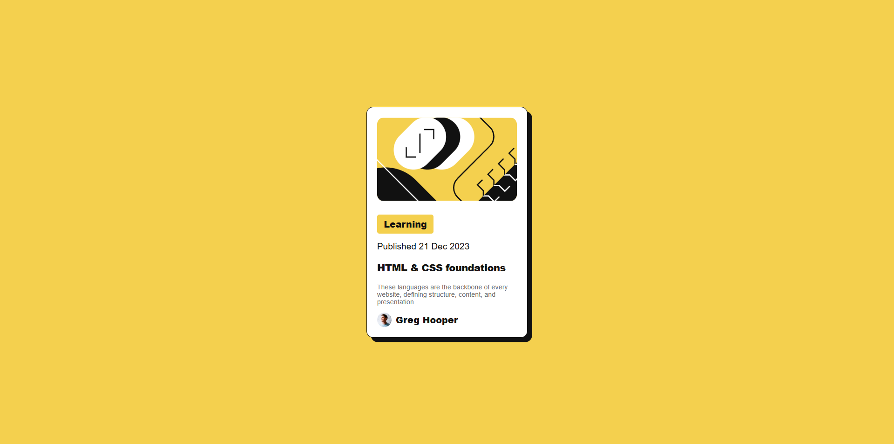

# Frontend Mentor - Blog preview card solution

This is a solution to the [Blog preview card challenge on Frontend Mentor](https://www.frontendmentor.io/challenges/blog-preview-card-ckPaj01IcS). Frontend Mentor challenges help you improve your coding skills by building realistic projects.

## Table of contents

- [Overview](#overview)
  - [The challenge](#the-challenge)
  - [Screenshot](#screenshot)
  - [Links](#links)
- [My process](#my-process)
  - [Built with](#built-with)
  - [What I learned](#what-i-learned)
  - [Continued development](#continued-development)
  - [Useful resources](#useful-resources)
- [Author](#author)

## Overview

### The challenge

Users should be able to:

- See hover and focus states for all interactive elements on the page

### Screenshot



### Links

- Solution URL: [Blog preview card](https://www.frontendmentor.io/solutions/blog-preview-card-solution-7UGgDvyb7d)
- Live Site URL: [Blog preiview card](https://blog-preview-card-frontend-challenge.netlify.app/)

## My process

### Built with

- Semantic HTML5 markup
- CSS custom properties
- Flexbox

### What I learned

I could learn how to make the hover effect affect an image and a text at the same time, by using the filter property.

```
.author:hover,
.author:focus {
  color: var(--gray-500);
}

.author:hover .author-img,
.author:focus .author-img {
  filter: brightness(75%);
}
```
Maybe it's not a perfect choice for the reducing the brightness< but at least I could come up with the idea.

I've used CSS custom properties for website colors, which makes the code easier to write and edit.

```
:root {
  --yellow: hsl(47, 88%, 63%);
  --white: hsl(0, 0%, 100%);
  --gray-500: hsl(0, 0%, 42%);
  --gray-950: hsl(0, 0%, 7%);
```

### Continued development

I still want to learn how to make the design more responsive, but I think I need some time for that.

### Useful resources

- [MDN - Using CSS custom properties (variables)](https://developer.mozilla.org/en-US/docs/Web/CSS/Guides/Cascading_variables/Using_custom_properties#using_the_property_at-rule) - This helped me understand how to use CSS custom variables.

## Author

- Website - [Ahmed Shabasy](www.linkedin.com/in/shabasy)
- Frontend Mentor - [@Ahmed-Shabasy](https://www.frontendmentor.io/profile/Ahmed-Shabasy)
